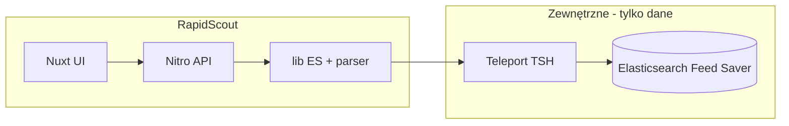

# Plan implementacji: RapidScout

> Samodzielna aplikacja Nuxt 3 — odczyt wiadomości LSports z Elasticsearch (Feed Saver) przez Teleport.  
> Ostatnia aktualizacja: 2026-05-15

## Zasada: w pełni standalone

RapidScout to **jedyna baza kodu** tego produktu. Plan, README, UI i implementacja **nie odnoszą się do innych repozytoriów** — ani jako miejsce pracy, ani jako zależność buildowa.

| Aspekt | Ustalenie |
|--------|-----------|
| **Produkt** | RapidScout — narzędzie webowe do analizy wiadomości `Incidents.Extracted` |
| **Repo** | Ten katalog (`RapidScout/`) |
| **Stack** | Nuxt 3 (`ssr: false`) + Nitro + Vue + `@nuxt/ui` |
| **Dane** | Elasticsearch (indeksy Feed Saver) — **tylko odczyt**, przez Teleport w dev |
| **Zależności** | Wyłącznie npm z własnego `package.json` |



Źródło wiadomości w ES (Kafka → Feed Saver) jest **poza zakresem RapidScout** — aplikacja zakłada, że dokumenty już istnieją w indeksie.

---

## Kontrakt danych (Elasticsearch)

RapidScout nie zarządza ingestem — operuje na ustalonym schemacie dokumentu:

```typescript
// lib/types/message-document.ts
interface MessageDocument {
  '@timestamp': number
  appMode: string
  eventId: string
  topic: string
  provider: string
  providerSeq: number
  headers: Record<string, unknown>
  rawPayload: string   // JSON string
  rawPayloadLength: number
}
```

| Stała | Wartość |
|-------|---------|
| Topic | `lsports-kafka.DI.LSI.Incidents.Extracted` |
| Indeks | `epg-v1-{beta\|production}-lsports-kafka` |
| `indexSchemaVersion` | `1` (stała w `lib/consts.ts`) |
| Event ID | pole `eventId` (= LSports Fixture ID) |

---

## Przypadek referencyjny (smoke test)

| Pole | Wartość |
|------|---------|
| **eventId** | `18664683` |
| **Data** | 13 maja 2026 |
| **Przedział** | 21:00 → 22:46 |
| **environment** | `production` (jeśli brak hitów — `beta`) |

Domyślne wartości w formularzu dev i pierwsze zapytanie ES przy implementacji parsera.

```sh
curl -s "http://localhost:4201/api/incidents-extracted/analyze?eventId=18664683&timestampFrom=2026-05-13T21:00:00&timestampTo=2026-05-13T22:46:00&environment=production" | jq '.meta, .analysis.summary'
```

**Strefa czasowa:** przy braku wyników sprawdzić ISO z `+02:00` (CEST) lub konwersję ISO → epoch ms dla pola `@timestamp`.

---

## Funkcjonalność MVP

### API

`GET /api/incidents-extracted/analyze`

| Param | Wymagany | Opis |
|-------|----------|------|
| `eventId` | tak | np. `18664683` |
| `timestampFrom` | tak | ISO datetime |
| `timestampTo` | tak | ISO, > from |
| `environment` | nie | `beta` \| `production`, domyślnie `production` |
| `maxResults` | nie | domyślnie 10000, cap 50000 |

Odpowiedź: `meta`, `messages[]` (seq, timestamp, sparsowany `rawPayload`), `analysis.incidents[]`, `analysis.summary` (`incidentTypes`).

Błędy: `400` walidacja, `502` ES niedostępny, `504` timeout 30s.

### Zapytanie ES (`lib/elasticsearch/incidents-extracted-messages.ts`)

- `bool.must`: `term eventId`, `term topic`, `range @timestamp`
- `sort`: `providerSeq asc`
- paginacja **`search_after`** (nie `from/offset`)
- `extractIncidentsFromPayload()` — ścieżka JSON ustalona na realnym payloadzie eventu **18664683**, nie na zgadywaniu

### UI (`app/`)

- Formularz: Event ID, od, do, environment, przycisk „Analizuj”
- Tabela wiadomości + modal JSON
- Tabela / timeline incidentów + podsumowanie typów
- Ostrzeżenie przy >10k wierszy

---

## Struktura repozytorium

```
RapidScout/
  package.json
  nuxt.config.ts              # port 4201, title: RapidScout
  tsconfig.json
  .env.development            # TSH=true, ELASTIC_URL=http://127.0.0.1:9200
  .gitignore
  README.md
  app/
    pages/index.vue
    components/
      IncidentsExtractedForm.vue
      IncidentsMessagesTable.vue
      IncidentsTimelineTable.vue
      JsonModal.vue
    utils/format-timestamp.utils.ts
  server/
    api/incidents-extracted/analyze.get.ts
    plugins/02.elastic-client.plugin.ts
    config/config.ts
  lib/
    types/message-document.ts
    consts.ts
    teleport/tsh.ts
    elasticsearch/
      incidents-extracted-messages.ts
      incidents-payload.parser.ts
      *.spec.ts
  docs/
    PLAN.md
    SPEC.md                     # spec funkcjonalna (do uzupełnienia)
```

**Uruchomienie dev:**

```sh
tsh login --proxy=teleport.statscore.com
npm install
npm run dev    # http://localhost:4201
```

---

## Kolejność prac

1. Szkielet Nuxt + `package.json` + README
2. Plugin ES + Teleport (`lib/teleport/tsh.ts`)
3. Zapytanie ES + testy mock
4. Weryfikacja payloadu na evencie **18664683**
5. Parser + testy z fixture z tego eventu
6. Endpoint `analyze.get.ts`
7. UI (formularz z wartościami referencyjnymi, tabele, modal)
8. Smoke test curl + przeglądarka

### Checklist zadań

- [ ] Szkielet: `package.json`, Nuxt 3 (`ssr:false`), port 4201, README
- [ ] `server/plugins` ES + `lib/teleport` — klient Elasticsearch, tsh proxy `es-feed-saver`
- [ ] Zapytanie ES dla eventId=18664683, 2026-05-13 21:00–22:46 — `@timestamp` + struktura payloadu
- [ ] `lib/`: `incidents-extracted-messages` + `incidents-payload.parser` + testy Vitest
- [ ] `GET /api/incidents-extracted/analyze` + formularz + tabele + JsonModal
- [ ] Test curl/UI na evencie 18664683 — kryteria akceptacji MVP

---

## Kryteria akceptacji

- [ ] `npm run dev` → RapidScout na `http://localhost:4201`
- [ ] Standalone: brak importów / submodule / dokumentacji wskazującej inne repo
- [ ] Analiza **18664683**, **2026-05-13 21:00–22:46**, topic `lsports-kafka.DI.LSI.Incidents.Extracted`
- [ ] Filtr czasu na `@timestamp`, tabele wiadomości i incidentów, podgląd JSON
- [ ] Teleport (`TSH=true`), środowiska beta i production
- [ ] Testy jednostkowe parsera i budowy zapytania ES
- [ ] README: uruchomienie w ≤15 linii

---

## Ryzyka

| Ryzyko | Mitigacja |
|--------|-----------|
| Format `@timestamp` | Pierwsze zapytanie na evencie 18664683; ewentualnie epoch ms |
| Struktura payloadu | Parser po realnych rekordach z ES |
| Brak Teleportu w dev | README + błąd 502 z jasnym komunikatem |
| Duży wynik (>10k) | `search_after`, cap 50k, ostrzeżenie w UI |

---

## Szacunek nakładu

| Etap | Szacunek |
|------|----------|
| Szkielet + konfiguracja | 2–3 h |
| ES + Teleport | 3–4 h |
| Parser (event 18664683) | 3–5 h |
| API + UI | 5–7 h |
| Testy + smoke | 2–3 h |
| **Razem** | **~2 dni** |

---

## Specyfikacja w repo

Przy implementacji uzupełnić `docs/SPEC.md` (na bazie `cursor-lsports-incidents-extracted-analysis-app.md`) — wyłącznie kontrakt RapidScout, bez odniesień do innych repozytoriów kodu.
