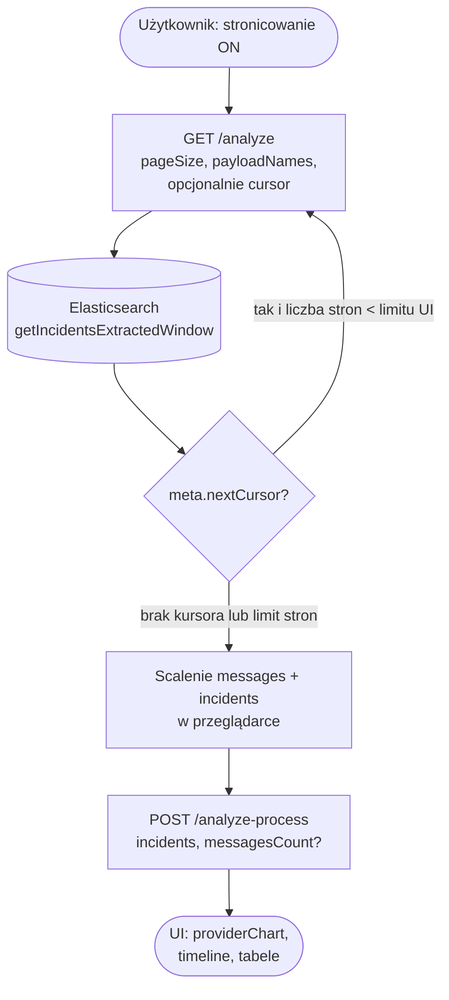

# RapidScout — specyfikacja skrócona

## API analizy

### `GET /api/incidents-extracted/analyze`

| Query | Opis |
|--------|------|
| `eventId`, `timestampFrom`, `timestampTo`, `environment` | Zakres zdarzenia i indeks (`buildLsportsKafkaIndex`). |
| `maxResults` | Tryb **pełny** (bez `pageSize`): pętla ES aż limit lub koniec; sort `providerSeq` ↑; max `HARD_MAX_RESULTS`. |
| `payloadNames` | Opcjonalnie: nazwy LSI po przecinku → filtr `rawPayload` (`buildRawPayloadNameFilter`). |
| `pageSize` | Tryb **strona**: jedna „strona” wyniku (wewnętrznie wiele `search` po `ES_PAGE_SIZE`); **`providerChart` i klastrowanie czasu nie są liczone** w tej odpowiedzi. |
| `cursor` | Base64 JSON tablicy `search_after` z poprzedniej strony; **wymaga** `pageSize`; zły cursor → 400. |

`meta`: m.in. `messageCount`, `truncated` (tryb `maxResults`), `pageMode`, `nextCursor`, `payloadNamesFilter`.

### `POST /api/incidents-extracted/analyze-process`

Ciało JSON: `{ "incidents": [ … ], "messagesCount"?: number }`.

- `incidents` — tablica obiektów jak z `analysis.incidents` po scaleniu stron z `GET`.
- `applyIncidentTimeClustering` + sort + `summarizeIncidentTypes` + `buildProviderChart`.
- `messagesCount` — opcjonalnie do `summary.messagesCount` (UI / raport).

### Diagram: tryb stronicowany (UI + API)

Na froncie (`app/pages/index.vue`) włączenie **„Pobierz w stronach (cursor)”** uruchamia pętlę `GET` z `pageSize`, a na końcu jedno `POST` — pełny wykres i klastrowanie powstają dopiero po scaleniu incydentów.

**Uwaga:** pojedyncze `GET` z `pageSize` **nie** zwraca `providerChart` ani nie robi `applyIncidentTimeClustering` na całości — to robi wyłącznie `POST /analyze-process` na scalonym zbiorze.

### Implementacja ES

- Wspólne `must`: `eventId`, `topic`, `@timestamp` — `buildMustClauses` w `lib/elasticsearch/incidents-extracted-messages.ts`.
- `getIncidentsExtractedMessages` — pętla `search_after` do `maxResults`.
- `getIncidentsExtractedPage` — pojedyncze `search`, `size` ≤ `ES_PAGE_SIZE`.
- `getIncidentsExtractedWindow` — składa żądany `pageSize` (np. 5000) z kilku wywołań `getIncidentsExtractedPage`.

## Topic

`lsports-kafka.DI.LSI.Incidents.Extracted`

## Provider w payloadzie

Po analizie eventu **18664683** (production, 2026-05-13 21:00–22:46):

| Pole | Ścieżka | Uwagi |
|------|---------|--------|
| Provider | `Provider.Id` | `PRIMARY_PROVIDER_FIELD` — np. `8`, `253`, `257` |
| Czas payloadu | `Timestamp` (ISO-8601) | Zob. `PAYLOAD_TIME_FIELD_PATHS` |
| Fallback | `MessageDocument.provider` | Gdy brak `Provider` w JSON |

**Etykiety na wykresie:** mapowanie wybranych `Provider.Id` → nazwa handlowa (`lib/analysis/provider-labels.ts`, funkcja `providerIdChartLabel`); brak w mapie → `P{id}`.

## Struktura wiadomości LSI

Jedna wiadomość ES = jeden event (`Name`, `Kind`, `Id`, `Period`, `Provider`).

Parser obsługuje też starszy format Trade: `Livescore.Periods[].Incidents[]` lub top-level `Incidents[]`.

## Wykres

`GET /api/incidents-extracted/analyze` (tryb **bez** `pageSize`) zwraca `analysis.providerChart`:

- `points[]` — `timeEs`, `timePayload`, `provider`, `incidentKey`, `name`, `kind`, `scoreLabel` (z `Values`) …
- `summaryEs` / `summaryPayload` — `winsByProvider`, `medianTimeByProvider`

W trybie **strona** (`pageSize` ustawione) pole `providerChart` **nie występuje**; klient scala `incidents` i woła `POST …/analyze-process`.

**Grupowanie incydentów (LSI, po `analyze`):** nie używamy samego wyniku z `Values` jako jedynego kryterium „tej samej” kartki u różnych providerów.

1. **Kubełek:** `Kind` + `Name` + `Period` + `Id` (np. `Statistic` + `YellowCard` + `2` + `6`).
2. **Czas:** sortowanie po `reportedAtEs` (czas ES wiadomości).
3. **Łańcuch:** kolejne wiadomości w kubełku należą do tego samego klastra, jeśli odstęp od **poprzedniej** w kolejności czasu jest ≤ `INCIDENT_TIME_CLUSTER_GAP_MS` (**12 s**, stała w `lib/consts.ts`).
4. **`incidentKey`:** po klastrowaniu ma postać `tc:Kind:Name:Period:Id:c{n}`.

**Uzasadnienie 12 s (event 18664683, 13.05.2026):** na próbce z początku strumienia kolejne komunikaty `YellowCard` rozdzielały się o **dziesiątki sekund** (osobne zdarzenia na boisku), podczas gdy ten sam fakt u różnych providerów zwykle pojawia się w odstępie rzędu ms–kilku sekund. **12 s** to zapas na wolniejsze feedy przy zachowaniu bezpiecznego odstępu od kolejnej prawdziwej kartki.

Parser nadal wypełnia `scoreLabel` z `Values` — używane w etykietach wykresu / tooltipach, **nie** jako jedyny klucz grupowania kartek.

**UI:** wykres opóźnień — oś X = zdarzenia (etykieta `Name` + wynik z `Values`), oś Y = opóźnienie względem najszybszego (skala log); serie = `providerIdChartLabel(provider)` (np. `Bet365 (8)`) lub `P{id}` dla nieznanych ID.
